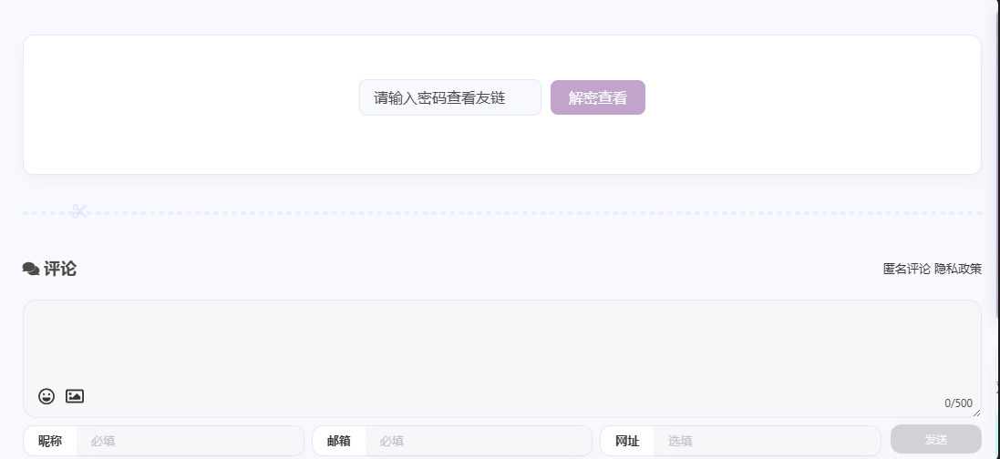

# anzhiyu_flink_encrypt
基于anzhiyu主题实现的一个简单的友链加密功能

效果图：



配置：
1. 你需要拥有anzhiyu主题，并配置好`https://docs.anheyu.com/page/links.html`文章基础友链的所有内容

2. 替换`- includes/page/flink.pug`为本项目flink.pug

3. 在站点配置文件/主题配置文件（_config.yml）中设置是否启用加密：`encrypted_friends: true`

4. 在你创建友链页面而生成的 \source\link\index.md 文件的 Front-matter 部分，添加以下参数：
```
password: your_password # 设置你的访问密码
message: 请输入密码查看友链
wrong_pass_message: 密码错误，请重试！
abstract: 这里是加密的友链页面，只有知道密码的朋友才能看到哦~
```

5. 引入CSS对加密页面进行美化
